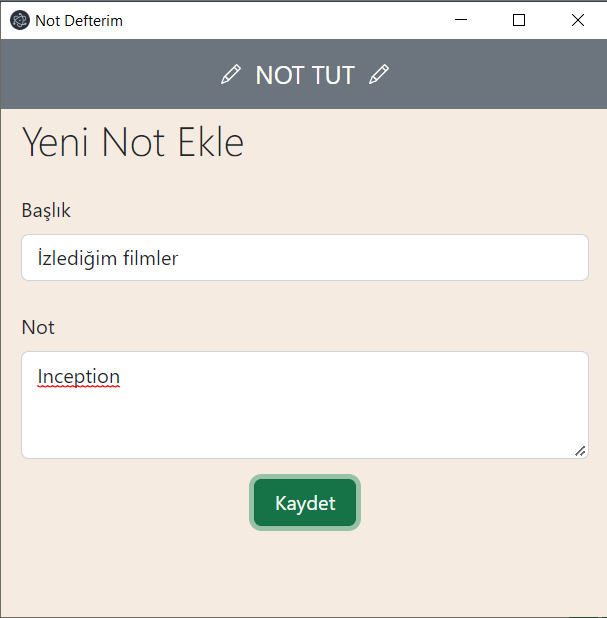
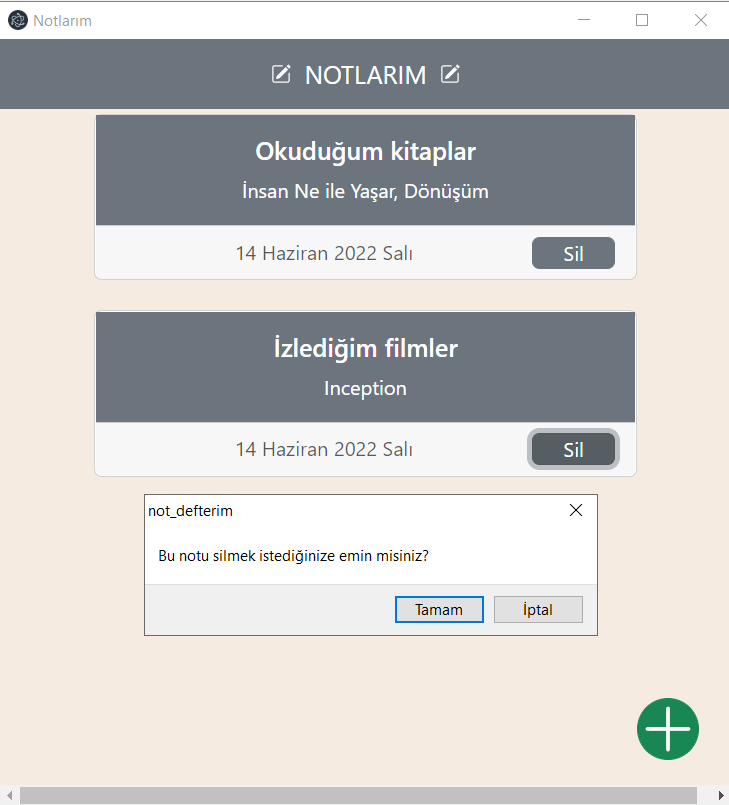
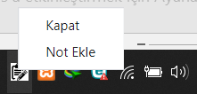

# not-defterim
Not tutma uygulaması - Note taking app

## Veri Tabanı  

Projemde veri tabanı bağlantısını kurmak için sequelize ve mysql2’yi kullandım. XAMPP ile MySQL ve Apache’yi aktif ettikten sonra phpMyAdmin’de de notlar görünmektedir.

Oluşturduğum tablo veriler klasörünün içindedir. Bağlantı da baglan klasörünün içinde bulunmaktadır.  

## Uygulamanın Tasarımı  

Notlarım ve not ekle penceresinin görünümü için Bootstrap kullanıp link olarak projeye dahil ettim. 

## Pencereler Arası Geçiş

Notlarım penceresinde notlar gösterilecek ve pencerenin sağ alt köşesinde not eklemek için yuvarlak bir buton yerleştirdim. Tıklama olayıyla birlikte not ekle penceresinin açılmasını sağladım. 

## Not Ekleme İşlemi

Not ekle penceresinde başlık ve not için iki input ve kaydetmek için bir buton bulunmakta. Ekleme işlemini ekle.js dosyasında yapıyorum. Kaydet tuşuna basıldığında kutucuklardaki verileri ekle.js dosyasına çekilip veri tabanında yeni bir not oluşturuluyor. 

## Not Yazdırma İşlemi  

Notları notlarım penceresine yazdırma işlemi not_yazdir.js dosyasında gerçekleşiyor. Notlar tablosundan veriler foreach ile çekilip pencereye yazdırılıyor. 

## Not Silme İşlemi

Notlar pencereye yazdırılırken her notun altına bir Sil butonu yerleştirdim. Sil butonuna basıldığı zaman butonun bulunduğu notun id’sini çekecek ve bunu not_sil.js dosyasındaki not_sil() metoduna gönderecek. Ekrana bir doğrulama penceresi çıkacak ve gerçekten silip silmediğini kontrol edecek. Cevap evetse not silinecek.

## Electron Kısmı

createWindow() metodu Notlarım penceresini oluşturuyor. Not ekle penceresi için de notEklePenceresiniOlustur() metodunu oluşturdum. Uygulama gösterildiği zaman görev çubuğunda uygulamanın bir simgesi çıkacak. Bu simgenin üstüne gelindiğinde “Not defterim “ yazacak. Çarpı tuşuna basıldığında uygulama gizlenecek ve simgenin üstüne çift tıklandığında açılacak. Simgeye sağ tıklandığında “Kapat” ve “Not Ekle” seçenekleri bulunuyor. 

 
